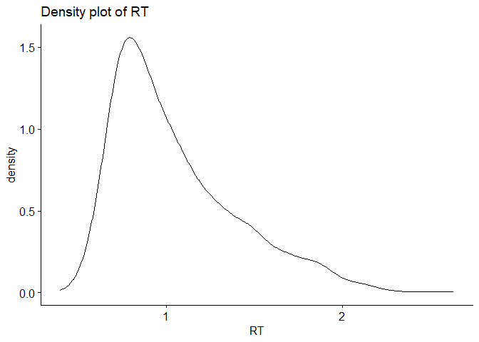

Behavioral Data
================
SYsherley
latest: 2023-08-16

This Markdown document includes a process for analyzing a behavioral
dataset that encompasses speech latencies recorded during a linguistics
experiment.

The analysis process involves calculating the mean reaction time (RT)
for each condition, visualizing the differences in RT among conditions
by generating violin plots, and conducting GLM models to explore the
influence of factors on RT.

The operational dataset has undergone cleaning and the removal of
outliers.

### Analysis process:

1.  Import Libraries
2.  Load Dataset
3.  Calculate Averages
4.  Visualization - Violin Plot
5.  Generalized Linear Mixed-Effects Models

``` r
library(tidyverse)
```

    ## ── Attaching core tidyverse packages ──────────────────────── tidyverse 2.0.0 ──
    ## ✔ dplyr     1.1.1     ✔ readr     2.1.4
    ## ✔ forcats   1.0.0     ✔ stringr   1.5.0
    ## ✔ ggplot2   3.4.2     ✔ tibble    3.2.1
    ## ✔ lubridate 1.9.2     ✔ tidyr     1.3.0
    ## ✔ purrr     1.0.1     
    ## ── Conflicts ────────────────────────────────────────── tidyverse_conflicts() ──
    ## ✖ dplyr::filter() masks stats::filter()
    ## ✖ dplyr::lag()    masks stats::lag()
    ## ℹ Use the conflicted package (<http://conflicted.r-lib.org/>) to force all conflicts to become errors

``` r
library(dplyr)     
library(Hmisc) 
```

    ## 
    ## Attaching package: 'Hmisc'
    ## 
    ## The following objects are masked from 'package:dplyr':
    ## 
    ##     src, summarize
    ## 
    ## The following objects are masked from 'package:base':
    ## 
    ##     format.pval, units

``` r
library(tibble) 
library(ggplot2)   
library(ggpubr)    # enhance ggplot2 visualizations
library(hrbrthemes)# additional themes and styling options for ggplot2 
```

    ## NOTE: Either Arial Narrow or Roboto Condensed fonts are required to use these themes.
    ##       Please use hrbrthemes::import_roboto_condensed() to install Roboto Condensed and
    ##       if Arial Narrow is not on your system, please see https://bit.ly/arialnarrow

``` r
library(ggsignif)  # significance brackets to ggplot2 plots
library(languageR) # statistical analysis of linguistic data
library(readxl)    # read Microsoft Excel files (.xls and .xlsx) into R as data frames
library(ez)        # analyze and visualize data from factorial experiments 
library(forcats)   # reorder factor levels 
library(lme4)      # linear mixed-effects models
```

    ## Loading required package: Matrix
    ## 
    ## Attaching package: 'Matrix'
    ## 
    ## The following objects are masked from 'package:tidyr':
    ## 
    ##     expand, pack, unpack

``` r
library(QuantPsyc) # quantitative psychological analyses
```

    ## Loading required package: boot
    ## Loading required package: MASS
    ## 
    ## Attaching package: 'MASS'
    ## 
    ## The following object is masked from 'package:dplyr':
    ## 
    ##     select
    ## 
    ## 
    ## Attaching package: 'QuantPsyc'
    ## 
    ## The following object is masked from 'package:Matrix':
    ## 
    ##     norm
    ## 
    ## The following object is masked from 'package:base':
    ## 
    ##     norm

``` r
library(sjmisc)    # missing values
```

    ## 
    ## Attaching package: 'sjmisc'
    ## 
    ## The following object is masked from 'package:Hmisc':
    ## 
    ##     %nin%
    ## 
    ## The following object is masked from 'package:purrr':
    ## 
    ##     is_empty
    ## 
    ## The following object is masked from 'package:tidyr':
    ## 
    ##     replace_na
    ## 
    ## The following object is masked from 'package:tibble':
    ## 
    ##     add_case

``` r
library(kableExtra)# pack_rows
```

    ## 
    ## Attaching package: 'kableExtra'
    ## 
    ## The following object is masked from 'package:dplyr':
    ## 
    ##     group_rows

``` r
library(car)       # regression analysis and model diagnostics
```

    ## Loading required package: carData
    ## 
    ## Attaching package: 'car'
    ## 
    ## The following object is masked from 'package:boot':
    ## 
    ##     logit
    ## 
    ## The following object is masked from 'package:dplyr':
    ## 
    ##     recode
    ## 
    ## The following object is masked from 'package:purrr':
    ## 
    ##     some

``` r
library(palmerpenguins) # visual
library(viridis)   # color scales
```

    ## Loading required package: viridisLite

``` r
library(cowplot)   # save figures in .png file
```

    ## 
    ## Attaching package: 'cowplot'
    ## 
    ## The following object is masked from 'package:ggpubr':
    ## 
    ##     get_legend
    ## 
    ## The following object is masked from 'package:lubridate':
    ## 
    ##     stamp

``` r
library(sjPlot)    # tab_model()
```

    ## 
    ## Attaching package: 'sjPlot'
    ## 
    ## The following objects are masked from 'package:cowplot':
    ## 
    ##     plot_grid, save_plot

``` r
library(sjlabelled)
```

    ## 
    ## Attaching package: 'sjlabelled'
    ## 
    ## The following object is masked from 'package:forcats':
    ## 
    ##     as_factor
    ## 
    ## The following object is masked from 'package:dplyr':
    ## 
    ##     as_label
    ## 
    ## The following object is masked from 'package:ggplot2':
    ## 
    ##     as_label

#### Load dataset

``` r
RTdata<-read_excel("RT.xls") 

head(RTdata, 3) # show 3 rows
```

    ## # A tibble: 3 × 18
    ##      Nr Determiner Item   G     S     Condition Marker Picture     RT SubjectNr.
    ##   <dbl> <chr>      <chr>  <chr> <chr> <chr>      <dbl> <chr>    <dbl> <chr>     
    ## 1    33 De         tafel  Inc   Rel   c2            52 table.j…  1.26 P01       
    ## 2    12 De         rivier Con   Rel   c1           121 river.j…  1.1  P01       
    ## 3    17 Het        oog    Con   Rel   c1           171 eye.jpg   1.10 P01       
    ## # ℹ 8 more variables: LexTALE <dbl>, AOA <dbl>, UseYear <dbl>, SelfRate <dbl>,
    ## #   AcqRoman <dbl>, AcqGerm <dbl>, AcqAsian <dbl>, OrderofLearning <dbl>

#### Average value

``` r
# Average of the 4 conditions
tapply(RTdata$RT,RTdata$Condition, mean)*1000
```

    ##       c1       c2       c3       c4 
    ## 1065.393 1079.983 1025.531 1035.525

``` r
tapply(RTdata$RT,RTdata$Condition, sd)*1000  # SD
```

    ##       c1       c2       c3       c4 
    ## 364.7251 369.5279 335.5612 353.8405

``` r
# Average of the G condition (with 2 levels)
tapply(RTdata$RT,RTdata$G, mean)*1000
```

    ##      Con      Inc 
    ## 1045.369 1057.393

``` r
tapply(RTdata$RT,RTdata$G, sd)*1000 # SD
```

    ##      Con      Inc 
    ## 350.7415 362.1150

We found that naming latencies are faster in the Con condition compared
to the Inc condition. The estimated difference is approximately 12 ms.

``` r
# Average of the S condition (with 2 levels)
tapply(RTdata$RT,RTdata$S, mean)*1000
```

    ##      Rel       Un 
    ## 1072.663 1030.568

``` r
tapply(RTdata$RT,RTdata$S, sd)*1000 # SD
```

    ##      Rel       Un 
    ## 366.9824 344.7333

Here, naming latencies in the Rel condition were longer compared to the
Un condition. The exitmated difference is around 52 ms.

#### Violin graph

    # prepare
    RTdata_2<-RTdata # create a new dataframe to plot
    RTdata_2$RT<-RTdata_2$RT*1000 # ms
    RTdata_2$Condition <- factor(RTdata_2$Condition, levels = c("c1","c2","c3","c4"))

    RTdata_2$S_status<-RTdata_2$S
    RTdata_2$S_status<-as.character(RTdata_2$S_status)
    RTdata_2$S_status[RTdata_2$S_status =="Rel"] <-"S+" # rename
    RTdata_2$S_status[RTdata_2$S_status =="Un"] <-"S-"
    RTdata_2$S_status<-as.factor(RTdata_2$S_status) 

    RTdata_2$G_status<-RTdata_2$G
    RTdata_2$G_status<-as.character(RTdata_2$G_status)
    RTdata_2$G_status[RTdata_2$G_status =="Con"] <-"G+"
    RTdata_2$G_status[RTdata_2$G_status =="Inc"] <-"G-"
    RTdata_2$G_status<-as.factor(RTdata_2$G_status) 

    levels(RTdata_2$S_status) # should be 2 levels
    levels(RTdata_2$G_status)

    RTdata_2<-RTdata_2 %>%
      mutate(day = fct_reorder(G_status, RT)) %>%
      mutate(day = factor(G_status, levels=c("G+", "G-"))) 

    RTdata_2<-RTdata_2 %>%
      mutate(day = fct_reorder(S_status, RT)) %>%
      mutate(day = factor(S_status, levels=c("S+", "S-"))) 

    plotS<-ggplot(RTdata_2, aes(x = S_status,y = RT,
                                 colour = G_status,fill = G_status))+ 
      scale_fill_manual(values = c("#FD744699","#ffc425"))+
      
      geom_violin(trim = FALSE,alpha = 0.7,position = position_dodge(width = 1)) +
      scale_color_manual(values = c("#FD744699","#ffc425"))+
      
      geom_point(position=position_jitterdodge(dodge.width=1),
                 colour = "brown",width = 0.8,alpha = 0.5,size = 0.5)+ 
      
      geom_boxplot(outlier.shape = NA,alpha=0.2,
                   size = 0.8,colour = "brown",position = position_dodge(width = 1)) 

    plotSRT<-plotS+
      theme(panel.background = element_blank(),
            panel.border = element_blank(),
            panel.grid.major = element_blank(), 
            panel.grid.minor = element_blank())+
      theme(legend.position="right")+
      labs(y= "Naming Latencies (ms)")+
      scale_y_continuous(limits=c(500,2500), breaks=seq(500,2500,500))+  # only show data > 500 ms
      
      theme(axis.title.x=element_blank(),
            #axis.text.x=element_blank(),
            axis.ticks.x=element_blank())+
      
      theme(axis.title.x = element_text(size=14,family="serif"),
            axis.title.y = element_text(size=16,family="serif"),
            axis.text.x = element_text(size=14,family="serif"),
            legend.title = element_text(size=14,family="serif"),
            legend.text = element_text(size=14,family="serif"))+
      
      theme(axis.text.y = element_text(size = 12,family="serif"))

    # add significance label
    plotSRT+geom_signif(comparisons = list(c("S+", "S-")), # add label
                test = wilcox.test, 
                y_position = c(2350), 
                size = 0.6, 
                textsize = 4, 
                vjust = -0.3, # the distance of text and line
                tip_length = c(0.02, 0.02), # the length of short line
                map_signif_level = T,
                colour='black')


    # save
    ggsave("RT.png", 
           width = 14, height = 9, units = "cm")

#### GLMM

    # check normalization
    ggdensity(RTdata$RT, 
              main = "Density plot of RT",
              xlab = "RT") 



Positively skewed

    # 
    RTdata$Item<-as.factor(RTdata$Item)
    RTdata$G<-as.factor(RTdata$G)
    RTdata$S<-as.factor(RTdata$S)

    # contrast coding
    contrasts(RTdata$G) # Con as reference
    contrasts(RTdata$S) # Rel as reference

``` r
# model
glmer_1<-glmer(RT~S*G+LexTALE+AOA+UseYear+SelfRate+AcqRoman+AcqGerm+AcqAsian+OrderofLearning +(S*G|SubjectNr.)+(1|Item),
                      data= RTdata,family = Gamma(link=identity))# failed
```

    ## Warning in checkConv(attr(opt, "derivs"), opt$par, ctrl = control$checkConv, :
    ## Model failed to converge with max|grad| = 0.249159 (tol = 0.002, component 1)

    ## Warning in checkConv(attr(opt, "derivs"), opt$par, ctrl = control$checkConv, : Model is nearly unidentifiable: very large eigenvalue
    ##  - Rescale variables?

``` r
rm(glmer_1)
```

``` r
# remove the Order of Dutch acquisition
glmer_2<-glmer(RT~S*G+LexTALE+AOA+UseYear+SelfRate+AcqRoman+AcqGerm+AcqAsian+(S*G|SubjectNr.)+(1|Item),
                      data= RTdata,family = Gamma(link=identity))
```

    ## Warning in checkConv(attr(opt, "derivs"), opt$par, ctrl = control$checkConv, :
    ## Model failed to converge with max|grad| = 0.468118 (tol = 0.002, component 1)

    ## Warning in checkConv(attr(opt, "derivs"), opt$par, ctrl = control$checkConv, : Model is nearly unidentifiable: very large eigenvalue
    ##  - Rescale variables?

``` r
## failed to converge. Model is nearly unidentifiable: very large eigenvalue
rm(glmer_2)
```

``` r
# remove the Acquisition of Asian languages
glmer_3<-glmer(RT~S*G+LexTALE+AOA+UseYear+SelfRate+AcqRoman+AcqGerm+(S*G|SubjectNr.)+(1|Item), data= RTdata,family = Gamma(link=identity))
```

    ## Warning in checkConv(attr(opt, "derivs"), opt$par, ctrl = control$checkConv, :
    ## Model failed to converge with max|grad| = 0.761656 (tol = 0.002, component 1)

    ## Warning in checkConv(attr(opt, "derivs"), opt$par, ctrl = control$checkConv, : Model is nearly unidentifiable: very large eigenvalue
    ##  - Rescale variables?

``` r
## failed to converge. 
rm(glmer_3)
```

``` r
# remove the Acquisition of Germanic languages
glmer_4<-glmer(RT~S*G+LexTALE+AOA+UseYear+SelfRate+AcqRoman+(S*G|SubjectNr.)+(1|Item),data= RTdata,family = Gamma(link=identity))
```

    ## Warning in checkConv(attr(opt, "derivs"), opt$par, ctrl = control$checkConv, :
    ## Model failed to converge with max|grad| = 0.271135 (tol = 0.002, component 1)

    ## Warning in checkConv(attr(opt, "derivs"), opt$par, ctrl = control$checkConv, : Model is nearly unidentifiable: very large eigenvalue
    ##  - Rescale variables?

``` r
## failed to converge. 
rm(glmer_4)
```

``` r
# remove the Acquisition of Romance languages
glmer_5<-glmer(RT~S*G+LexTALE+AOA+UseYear+SelfRate+(S*G|SubjectNr.)+(1|Item),data= RTdata,family = Gamma(link=identity))
```

    ## Warning in checkConv(attr(opt, "derivs"), opt$par, ctrl = control$checkConv, :
    ## Model failed to converge with max|grad| = 0.0606964 (tol = 0.002, component 1)

    ## Warning in checkConv(attr(opt, "derivs"), opt$par, ctrl = control$checkConv, : Model is nearly unidentifiable: very large eigenvalue
    ##  - Rescale variables?

``` r
## failed to converge. 
rm(glmer_5)
```

``` r
# remove the Self-rating score
glmer_6<-glmer(RT~S*G+LexTALE+AOA+UseYear+(S*G|SubjectNr.)+(1|Item),data= RTdata,family = Gamma(link=identity))
```

    ## Warning in checkConv(attr(opt, "derivs"), opt$par, ctrl = control$checkConv, :
    ## Model failed to converge with max|grad| = 0.373769 (tol = 0.002, component 1)

    ## Warning in checkConv(attr(opt, "derivs"), opt$par, ctrl = control$checkConv, : Model is nearly unidentifiable: very large eigenvalue
    ##  - Rescale variables?

``` r
## failed to converge. 
rm(glmer_6)
```

``` r
# remove the year of usage
glmer_7<-glmer(RT~S*G+LexTALE+AOA+(S*G|SubjectNr.)+(1|Item),data= RTdata,family = Gamma(link=identity))
```

    ## Warning in checkConv(attr(opt, "derivs"), opt$par, ctrl = control$checkConv, :
    ## Model failed to converge with max|grad| = 0.179777 (tol = 0.002, component 1)

    ## Warning in checkConv(attr(opt, "derivs"), opt$par, ctrl = control$checkConv, : Model is nearly unidentifiable: very large eigenvalue
    ##  - Rescale variables?

``` r
## failed to converge. 
rm(glmer_7)
```

``` r
# remove AOA
glmer_8<-glmer(RT~S*G+LexTALE+(S*G|SubjectNr.)+(1|Item),data= RTdata,family = Gamma(link=identity))
```

    ## Warning in checkConv(attr(opt, "derivs"), opt$par, ctrl = control$checkConv, :
    ## Model failed to converge with max|grad| = 0.0421336 (tol = 0.002, component 1)

    ## Warning in checkConv(attr(opt, "derivs"), opt$par, ctrl = control$checkConv, : Model is nearly unidentifiable: very large eigenvalue
    ##  - Rescale variables?

``` r
## failed to converge. 
rm(glmer_8)
```

``` r
# remove LexTale
glmer_9<-glmer(RT~S*G+ (S*G|SubjectNr.)+(1|Item),data= RTdata,family = Gamma(link=identity))
```

    ## Warning in checkConv(attr(opt, "derivs"), opt$par, ctrl = control$checkConv, :
    ## Model failed to converge with max|grad| = 0.0261514 (tol = 0.002, component 1)

``` r
## failed to converge. 
rm(glmer_9)
```

``` r
# remove the interaction for S * G by subject
glmer_10<-glmer(RT~S*G
                  +(S+G|SubjectNr.)+(1|Item),
                  data= RTdata,family = Gamma(link=identity))
```

    ## boundary (singular) fit: see help('isSingular')

``` r
## singular fit
rm(glmer_10)
```

``` r
# remove the interaction for S * G 
glmer_11<-glmer(RT~S+G
                  +(S+G|SubjectNr.)+(1|Item),
                  data= RTdata,family = Gamma(link=identity))
```

    ## Warning in checkConv(attr(opt, "derivs"), opt$par, ctrl = control$checkConv, :
    ## Model failed to converge with max|grad| = 0.00459682 (tol = 0.002, component 1)

``` r
## failed to converge
rm(glmer_11)
```

``` r
# remove by-subject G
glmer_12<-glmer(RT~S*G
                  +(S|SubjectNr.)+(1|Item),
                  data= RTdata,family = Gamma(link=identity))
```

    ## boundary (singular) fit: see help('isSingular')

``` r
## failed to converge
rm(glmer_12)
```

``` r
# remove by-subject S
glmer_13<-glmer(RT~S*G
                  +(G|SubjectNr.)+(1|Item),
                  data= RTdata,family = Gamma(link=identity))
```

``` r
## failed to converge
rm(glmer_13)
```

``` r
# remove by-subject S
glmer_14<-glmer(RT~S*G
                  +(1|SubjectNr.)+(1|Item),
                  data= RTdata,family = Gamma(link=identity))
```

``` r
summary(glmer_14)
```

    ## Generalized linear mixed model fit by maximum likelihood (Laplace
    ##   Approximation) [glmerMod]
    ##  Family: Gamma  ( identity )
    ## Formula: RT ~ S * G + (1 | SubjectNr.) + (1 | Item)
    ##    Data: RTdata
    ## 
    ##      AIC      BIC   logLik deviance df.resid 
    ##    124.2    162.3    -55.1    110.2     1713 
    ## 
    ## Scaled residuals: 
    ##     Min      1Q  Median      3Q     Max 
    ## -2.0855 -0.6833 -0.1876  0.4943  4.7007 
    ## 
    ## Random effects:
    ##  Groups     Name        Variance Std.Dev.
    ##  Item       (Intercept) 0.004514 0.06719 
    ##  SubjectNr. (Intercept) 0.008297 0.09109 
    ##  Residual               0.068449 0.26163 
    ## Number of obs: 1720, groups:  Item, 26; SubjectNr., 19
    ## 
    ## Fixed effects:
    ##             Estimate Std. Error t value Pr(>|z|)    
    ## (Intercept)  1.12732    0.06856  16.442   <2e-16 ***
    ## SUn         -0.02720    0.01624  -1.676   0.0938 .  
    ## GInc         0.02998    0.01677   1.788   0.0738 .  
    ## SUn:GInc    -0.03370    0.02308  -1.460   0.1443    
    ## ---
    ## Signif. codes:  0 '***' 0.001 '**' 0.01 '*' 0.05 '.' 0.1 ' ' 1
    ## 
    ## Correlation of Fixed Effects:
    ##          (Intr) SUn    GInc  
    ## SUn      -0.122              
    ## GInc     -0.118  0.504       
    ## SUn:GInc  0.085 -0.706 -0.726

``` r
# remove interaction of two fixed effects
glmer_15<-glmer(RT~S+G
                  +(1|SubjectNr.)+(1|Item),
                  data= RTdata,family = Gamma(link=identity))
```

``` r
summary(glmer_15)
```

    ## Generalized linear mixed model fit by maximum likelihood (Laplace
    ##   Approximation) [glmerMod]
    ##  Family: Gamma  ( identity )
    ## Formula: RT ~ S + G + (1 | SubjectNr.) + (1 | Item)
    ##    Data: RTdata
    ## 
    ##      AIC      BIC   logLik deviance df.resid 
    ##    124.3    157.0    -56.1    112.3     1714 
    ## 
    ## Scaled residuals: 
    ##     Min      1Q  Median      3Q     Max 
    ## -2.1051 -0.6764 -0.1954  0.4921  4.6291 
    ## 
    ## Random effects:
    ##  Groups     Name        Variance Std.Dev.
    ##  Item       (Intercept) 0.004509 0.06715 
    ##  SubjectNr. (Intercept) 0.008299 0.09110 
    ##  Residual               0.068584 0.26189 
    ## Number of obs: 1720, groups:  Item, 26; SubjectNr., 19
    ## 
    ## Fixed effects:
    ##             Estimate Std. Error t value Pr(>|z|)    
    ## (Intercept)  1.13593    0.06826  16.641  < 2e-16 ***
    ## SUn         -0.04396    0.01151  -3.819 0.000134 ***
    ## GInc         0.01220    0.01153   1.057 0.290381    
    ## ---
    ## Signif. codes:  0 '***' 0.001 '**' 0.01 '*' 0.05 '.' 0.1 ' ' 1
    ## 
    ## Correlation of Fixed Effects:
    ##      (Intr) SUn   
    ## SUn  -0.091       
    ## GInc -0.085  0.018

``` r
anova(glmer_15,glmer_14)# p(interaction of G*S)>.05. glmer_15
```

    ## Data: RTdata
    ## Models:
    ## glmer_15: RT ~ S + G + (1 | SubjectNr.) + (1 | Item)
    ## glmer_14: RT ~ S * G + (1 | SubjectNr.) + (1 | Item)
    ##          npar    AIC    BIC  logLik deviance  Chisq Df Pr(>Chisq)
    ## glmer_15    6 124.29 156.99 -56.143   112.29                     
    ## glmer_14    7 124.16 162.31 -55.077   110.16 2.1318  1     0.1443

``` r
# plot glmer_15
plot(glmer_15)
```

<!-- -->

``` r
# save table to html file
tab_model(glmer_15,show.se = TRUE,transform = NULL) 
```

<table style="border-collapse:collapse; border:none;">
<tr>
<th style="border-top: double; text-align:center; font-style:normal; font-weight:bold; padding:0.2cm;  text-align:left; ">
 
</th>
<th colspan="4" style="border-top: double; text-align:center; font-style:normal; font-weight:bold; padding:0.2cm; ">
RT
</th>
</tr>
<tr>
<td style=" text-align:center; border-bottom:1px solid; font-style:italic; font-weight:normal;  text-align:left; ">
Predictors
</td>
<td style=" text-align:center; border-bottom:1px solid; font-style:italic; font-weight:normal;  ">
Estimates
</td>
<td style=" text-align:center; border-bottom:1px solid; font-style:italic; font-weight:normal;  ">
std. Error
</td>
<td style=" text-align:center; border-bottom:1px solid; font-style:italic; font-weight:normal;  ">
CI
</td>
<td style=" text-align:center; border-bottom:1px solid; font-style:italic; font-weight:normal;  ">
p
</td>
</tr>
<tr>
<td style=" padding:0.2cm; text-align:left; vertical-align:top; text-align:left; ">
(Intercept)
</td>
<td style=" padding:0.2cm; text-align:left; vertical-align:top; text-align:center;  ">
1.14
</td>
<td style=" padding:0.2cm; text-align:left; vertical-align:top; text-align:center;  ">
0.07
</td>
<td style=" padding:0.2cm; text-align:left; vertical-align:top; text-align:center;  ">
1.00 – 1.27
</td>
<td style=" padding:0.2cm; text-align:left; vertical-align:top; text-align:center;  ">
<strong>\<0.001</strong>
</td>
</tr>
<tr>
<td style=" padding:0.2cm; text-align:left; vertical-align:top; text-align:left; ">
S \[Un\]
</td>
<td style=" padding:0.2cm; text-align:left; vertical-align:top; text-align:center;  ">
-0.04
</td>
<td style=" padding:0.2cm; text-align:left; vertical-align:top; text-align:center;  ">
0.01
</td>
<td style=" padding:0.2cm; text-align:left; vertical-align:top; text-align:center;  ">
-0.07 – -0.02
</td>
<td style=" padding:0.2cm; text-align:left; vertical-align:top; text-align:center;  ">
<strong>\<0.001</strong>
</td>
</tr>
<tr>
<td style=" padding:0.2cm; text-align:left; vertical-align:top; text-align:left; ">
G \[Inc\]
</td>
<td style=" padding:0.2cm; text-align:left; vertical-align:top; text-align:center;  ">
0.01
</td>
<td style=" padding:0.2cm; text-align:left; vertical-align:top; text-align:center;  ">
0.01
</td>
<td style=" padding:0.2cm; text-align:left; vertical-align:top; text-align:center;  ">
-0.01 – 0.03
</td>
<td style=" padding:0.2cm; text-align:left; vertical-align:top; text-align:center;  ">
0.291
</td>
</tr>
<tr>
<td colspan="5" style="font-weight:bold; text-align:left; padding-top:.8em;">
Random Effects
</td>
</tr>
<tr>
<td style=" padding:0.2cm; text-align:left; vertical-align:top; text-align:left; padding-top:0.1cm; padding-bottom:0.1cm;">
σ<sup>2</sup>
</td>
<td style=" padding:0.2cm; text-align:left; vertical-align:top; padding-top:0.1cm; padding-bottom:0.1cm; text-align:left;" colspan="4">
0.07
</td>
</tr>
<tr>
<td style=" padding:0.2cm; text-align:left; vertical-align:top; text-align:left; padding-top:0.1cm; padding-bottom:0.1cm;">
τ<sub>00</sub> <sub>Item</sub>
</td>
<td style=" padding:0.2cm; text-align:left; vertical-align:top; padding-top:0.1cm; padding-bottom:0.1cm; text-align:left;" colspan="4">
0.00
</td>
<tr>
<td style=" padding:0.2cm; text-align:left; vertical-align:top; text-align:left; padding-top:0.1cm; padding-bottom:0.1cm;">
τ<sub>00</sub> <sub>SubjectNr.</sub>
</td>
<td style=" padding:0.2cm; text-align:left; vertical-align:top; padding-top:0.1cm; padding-bottom:0.1cm; text-align:left;" colspan="4">
0.01
</td>
<tr>
<td style=" padding:0.2cm; text-align:left; vertical-align:top; text-align:left; padding-top:0.1cm; padding-bottom:0.1cm;">
ICC
</td>
<td style=" padding:0.2cm; text-align:left; vertical-align:top; padding-top:0.1cm; padding-bottom:0.1cm; text-align:left;" colspan="4">
0.16
</td>
<tr>
<td style=" padding:0.2cm; text-align:left; vertical-align:top; text-align:left; padding-top:0.1cm; padding-bottom:0.1cm;">
N <sub>SubjectNr.</sub>
</td>
<td style=" padding:0.2cm; text-align:left; vertical-align:top; padding-top:0.1cm; padding-bottom:0.1cm; text-align:left;" colspan="4">
19
</td>
<tr>
<td style=" padding:0.2cm; text-align:left; vertical-align:top; text-align:left; padding-top:0.1cm; padding-bottom:0.1cm;">
N <sub>Item</sub>
</td>
<td style=" padding:0.2cm; text-align:left; vertical-align:top; padding-top:0.1cm; padding-bottom:0.1cm; text-align:left;" colspan="4">
26
</td>
<tr>
<td style=" padding:0.2cm; text-align:left; vertical-align:top; text-align:left; padding-top:0.1cm; padding-bottom:0.1cm; border-top:1px solid;">
Observations
</td>
<td style=" padding:0.2cm; text-align:left; vertical-align:top; padding-top:0.1cm; padding-bottom:0.1cm; text-align:left; border-top:1px solid;" colspan="4">
1720
</td>
</tr>
<tr>
<td style=" padding:0.2cm; text-align:left; vertical-align:top; text-align:left; padding-top:0.1cm; padding-bottom:0.1cm;">
Marginal R<sup>2</sup> / Conditional R<sup>2</sup>
</td>
<td style=" padding:0.2cm; text-align:left; vertical-align:top; padding-top:0.1cm; padding-bottom:0.1cm; text-align:left;" colspan="4">
0.006 / 0.163
</td>
</tr>
</table>

Short summary: S significantly affects RT.<br/> G does not significantly
affect RT, despite a descriptive trend. <br/> There is no interaction of
S and G.
